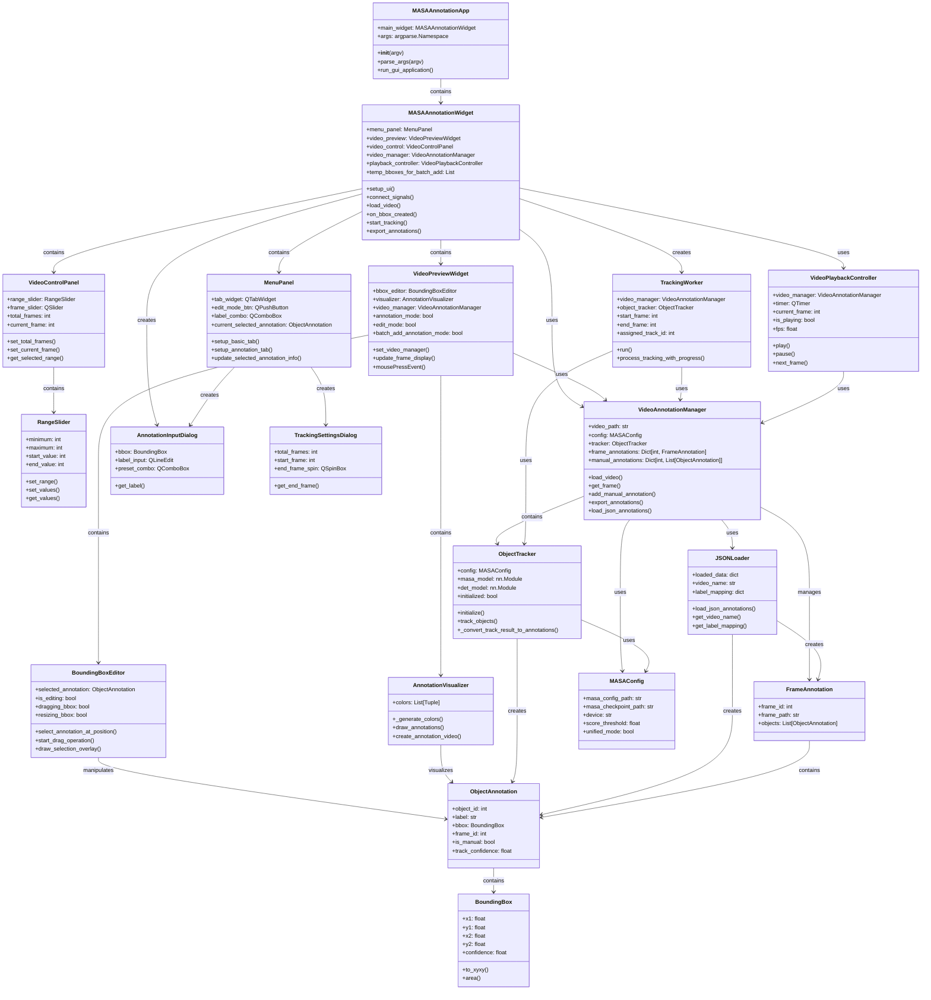

# Class Diaglam

## MASAAnnotationApp

## 主要な関係性の説明

### 1. アーキテクチャ階層
- **MASAAnnotationApp**: アプリケーションのエントリーポイント
- **MASAAnnotationWidget**: メインコントローラー、全UIコンポーネントを統合
- **UI Components**: MenuPanel、VideoPreviewWidget、VideoControlPanel

### 2. データフロー
- **VideoAnnotationManager**: 中央データ管理、動画とアノテーションを統合管理
- **ObjectTracker**: MASA推論エンジン、自動追跡処理
- **JSONLoader**: 外部データ読み込み

### 3. 編集・可視化
- **BoundingBoxEditor**: バウンディングボックスの直接編集
- **AnnotationVisualizer**: アノテーション結果の可視化

### 4. 非同期処理
- **TrackingWorker**: バックグラウンドでの重い追跡処理
- **VideoPlaybackController**: 動画再生制御

このアーキテクチャにより、MASAの自動追跡機能と手動アノテーション機能を統合した効率的なデータセット作成ツールが実現されています。